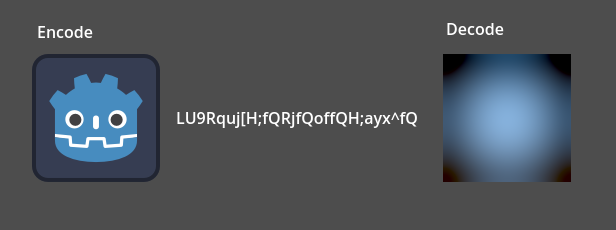

# Godot-BlurHash
[BlurHash](https://blurha.sh/) decoder/encoder implementation in GDScript.

This allows you to decode BlurHash strings: web-friendly and short strings that represent an image's placeholder. Likewise, you can encode any `Texture` into a BlurHash string:



## Installation

> This is the Godot 4.0 version. For the Godot 3.x version, check the [3.x branch](https://github.com/rsubtil/godot-blurhash/tree/3.x)

The minimum Godot version is 4.0 (stable).

Download this repository and copy the `addons` folder to your project root directory.

Then activate **Godot-BlurHash** in your project plugins.

## Usage

```gdscript
## Encoding (Texture to Hash)

# Encode (with default 4:3 components)
BlurHash.encode(preload("res://icon.svg")) # LU9Rquj[H;fQRjfQoffQH;ayx^fQ
# Encode with 7 x-components and 2 y-components. These components control how many colors
# are extracted in each axis and used for the placeholder.
BlurHash.encode(preload("res://icon.svg"), 7, 2) # FT9Rquj[H;fQRPays:RjfQoffQj]fRay

## Decoding (Hash to Texture)

# Decode (with 128x128 size and default 1.0 punch)
BlurHash.decode("LU9Rquj[H;fQRjfQoffQH;ayx^fQ", 128, 128)
# Decode (with 64x96 size and "more" punch)
# "punch" controls the output constrast; a bigger value makes the colors pop out more.
BlurHash.decode("FT9Rquj[H;fQRPays:RjfQoffQj]fRay", 64, 96, 1.7)
```

> **Warning**
>
> When decoding, use low width/height values, and then scale the texture to the desired size. There is no perceptible loss of quality for doing this since the image is already blurry, and using large sizes can be very slow since the image's pixels are being generated on the CPU instead of the GPU.

## License

This addon is licensed under the MIT license. Full details at [LICENSE](LICENSE).

This addon uses the [C implementation](https://github.com/woltapp/blurhash/tree/master/C) of the BlurHash algorithm, which is also under the [MIT license](https://github.com/woltapp/blurhash/blob/master/License.md). Other than some changes to integrate better in Godot, no modifications to the algorithm were made.